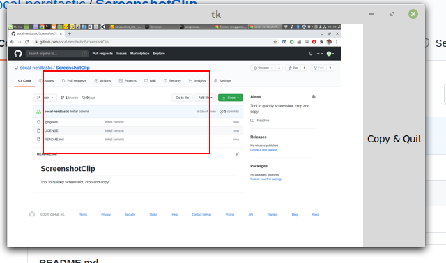

# ScreenshotClip
Tool to quickly screenshot, crop and copy on Linux. Written with python and tkinter. 

Install requirements: 

    sudo apt install scrot xclip
    sudo python3 -m pip pillow pyscreeze

